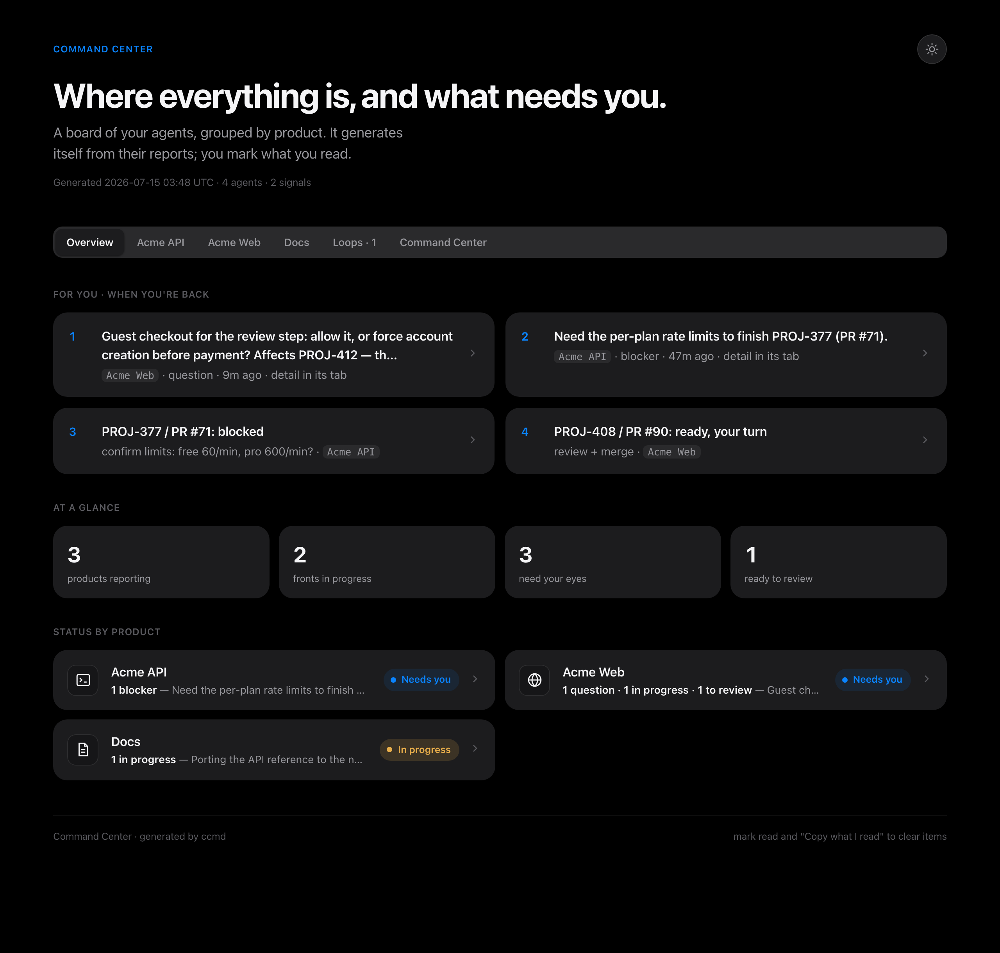
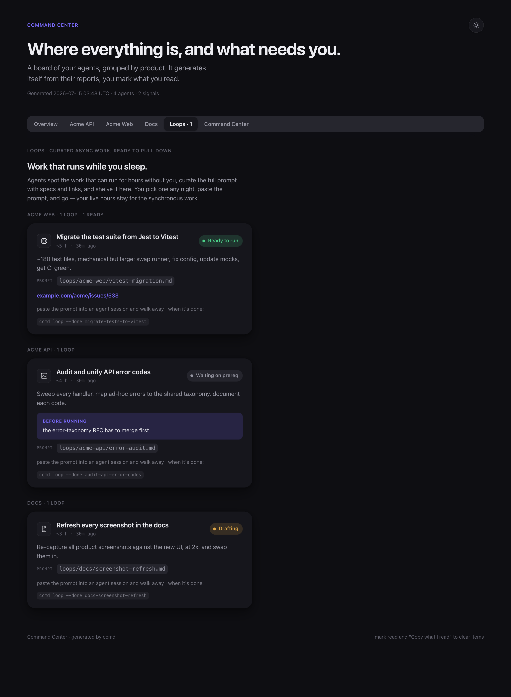
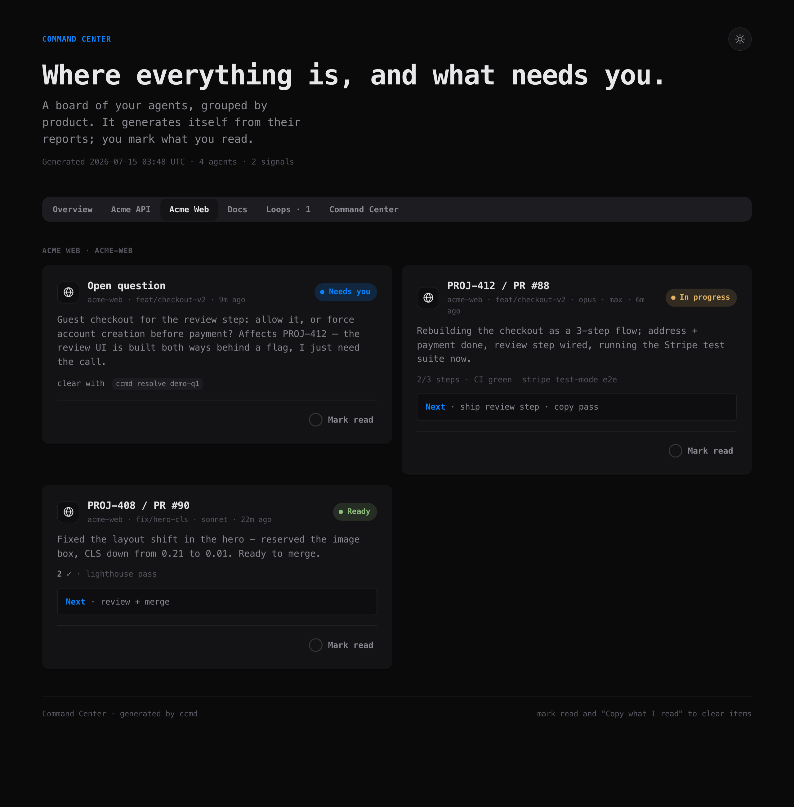
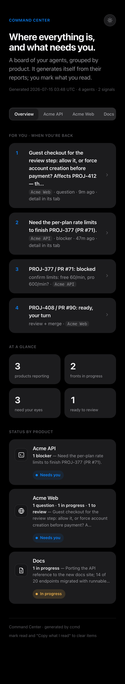

# Command Center

**Run a fleet of coding agents like a team.** One board where every agent —
across every project, repo and session — reports what it's doing, what's blocked,
and what needs *you*. You glance at it when you're back at your machine and see,
in one screen, the two things that actually matter: **what needs a decision**, and
**what's ready to review**.



If you drive more than one agent at a time, you know the failure mode: five
terminals, three repos, and no idea which one is stuck waiting on you. Command
Center fixes that. Agents write short status reports to a local store; the board
generates itself from that store and groups everything by product. No dashboards
to wire up, no service to run — it's a ~800-line Node CLI with **zero
dependencies**.

## Install

```bash
npx skills add chakkyy/agent-command-center
```

That drops the `command-center` skill into your agent. Then, once:

```bash
ccmd init      # interactive setup: your products, theme, features
ccmd demo      # optional: seed an example board to look at first
ccmd serve     # → http://localhost:7777
```

> `ccmd` lives in `skills/command-center/bin/ccmd`. Put it on your `PATH`, alias
> it, or let the [hooks](hooks/) call it by absolute path.

## How it works

1. **Agents report themselves.** At the end of a turn, or the moment they're
   blocked, they run one command:

   ```bash
   ccmd report --status IN_PROGRESS --summary "Rebuilding checkout as a 3-step flow; running the Stripe suite now" --task "PROJ-412 / PR #88" --next "ship review step"
   ccmd signal --kind question --msg "Guest checkout, or force account creation? UI is built both ways behind a flag — I just need the call."
   ```

2. **The board generates itself** from the store (`$ACC_HOME`, default
   `~/.agents-command-center`). `project` and `branch` auto-derive from git.
   Nobody hand-edits HTML.

3. **You read it and clear items.** On `ccmd serve`, "Mark read" persists
   instantly. Anywhere else, "Copy what I read" hands you a line you paste back
   into any agent chat to drop those items.

The **Overview** is deliberately a triage screen: one line per pending item, each
jumping to the product tab that holds the full detail. Blockers and questions
stay pinned, highlighted, until an agent resolves them.

## Loops — work that runs while you sleep

Some work can run for *hours* without you: a big migration, a deep refactor, a
backlog burn-down. Instead of losing it in a tracker, an agent curates the full
paste-ready prompt and shelves it as a **loop**. You pick one any night, paste
it, and go.



```bash
ccmd loop --title "Migrate the test suite to Vitest" --hours 5 --status ready \
  --prompt-path loops/web/vitest-migration.md --project web
```

## Themes

Three built-in themes plus a custom accent, injected as CSS variables at render
time. `swiss` (Apple-ish, light/dark auto), `terminal` (dense mono, ops vibe),
and `soft` (Linear-like).



## Make it automatic (optional)

The [hooks](hooks/) wire reporting into Claude Code so agents can't forget: a
`Stop` hook blocks a turn that changed a repo without reporting (once, never
loops), and re-renders the board; a `UserPromptSubmit` hook archives what you've
read when you come back.

## Why local-first

This started life publishing an HTML mirror to a hosted page on every turn. That
was pure overhead — re-uploading the whole board on every report. The live
`ccmd serve` at `localhost` is the default now; the hosted mirror survives only
as an optional adapter (`features.mirror`) for teams that want a shared URL.

## Reference

- **[The agent protocol →](skills/command-center/SKILL.md)** — what agents should
  report, when, and how (this is the heart of it).
- **[Full CLI reference →](skills/command-center/reference.md)**
- **[Hooks →](hooks/)**

Works on mobile too:



MIT licensed.
